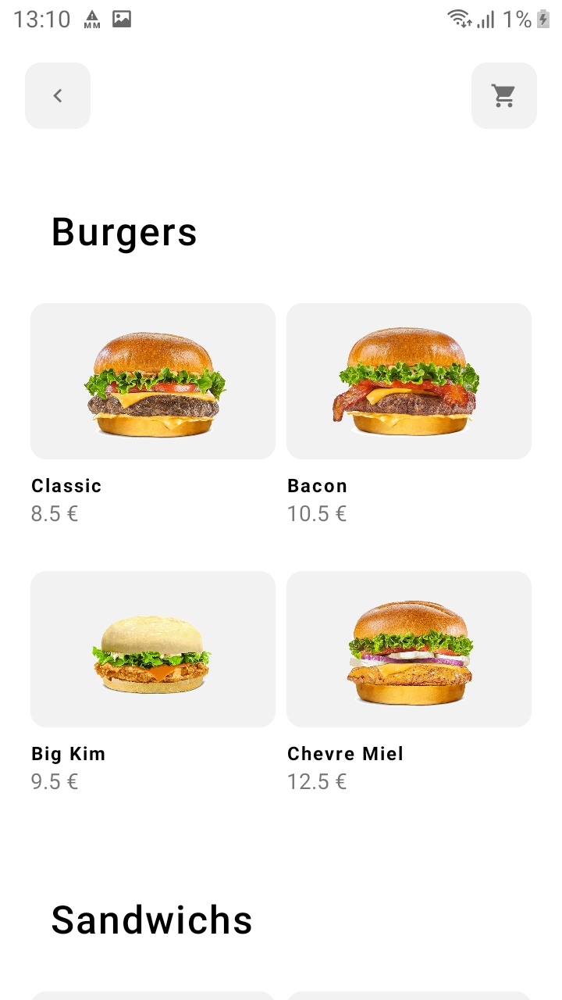
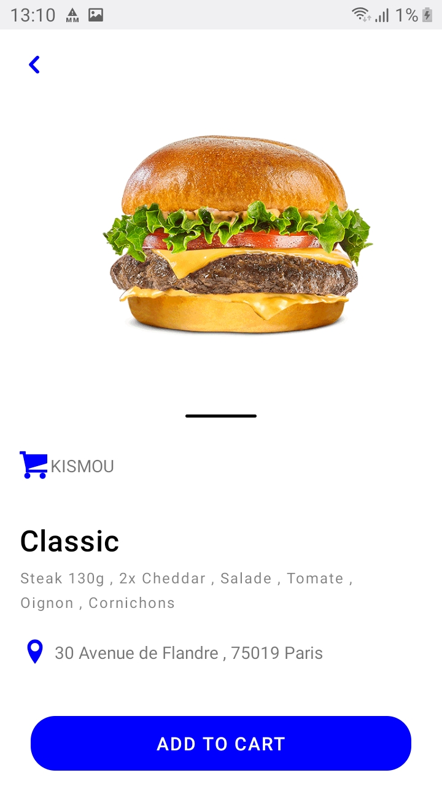
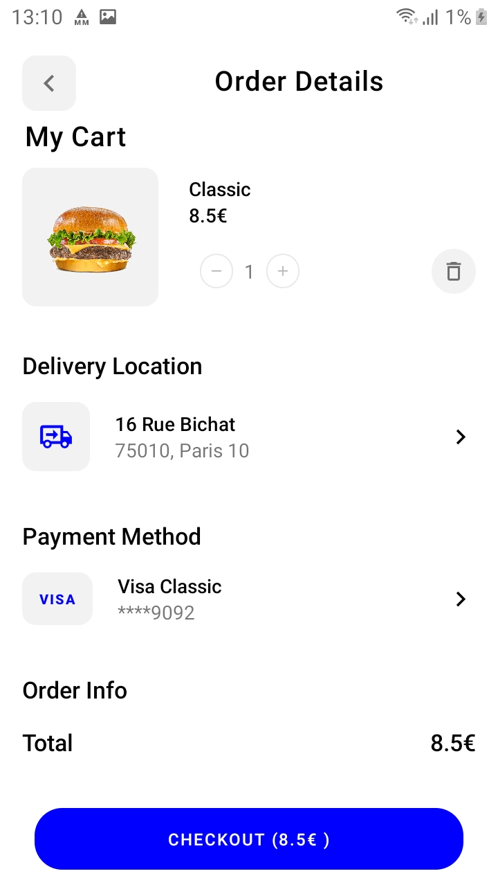

# Kimsou app

This is the Kimsou app to place your order from our restaurant.

### Install dependencies

```
npm install
```

### Run Server

```
npx react-native run-android
```
<p style="display:inline-block;">
   
  . . . <br><br><br>
   
  . . .
</p>
